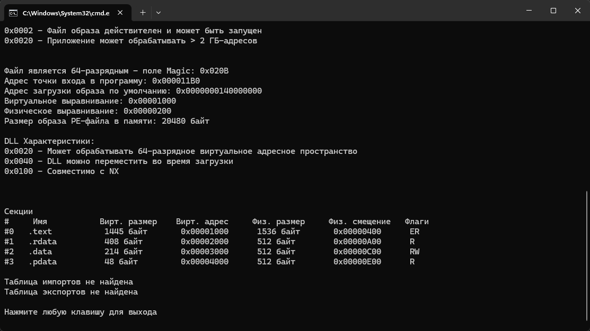
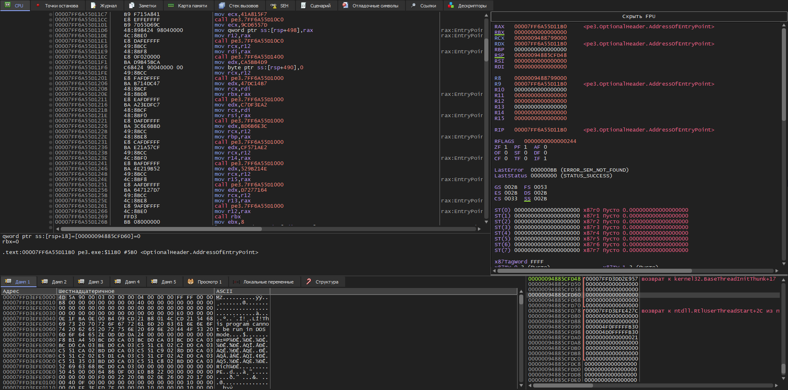

# winapihashing

Если попробовать проанализировать "PE3.exe" в PE-анализаторе из первой лабораторной работе, то мы удостоверимся в том, что таблица импортов скрыта. Поэтому используем динамический анализ в x64dbg



После остановки на точке входа 
в дизассемблере было обнаружено многократное повторение вызова одной и той 
же функции:

```
call pe3.7FF6A55D1000
call pe3.7FF6A55D1000
call pe3.7FF6A55D1000
...
```



Была установлена точка останова на эту функцию. При каждой остановке 
в регистре RAX находился адрес найденной WinAPI функции, либо она 
сразу сохранялась в один из регистров R12-R15.

## Результат

### kernel32.dll
- GetStdHandle
- lstrlen
- WriteConsoleA
- SetConsoleCursorPosition
- FlushConsoleInputBuffer
- GetProcessHeap
- GetModuleFileNameW
- CreateFileW
- SetFileInformationByHandle
- CloseHandle

### ntdll.dll
- RtlZeroMemory
- RtlCopyMemory

[Скриншоты](./assets)

